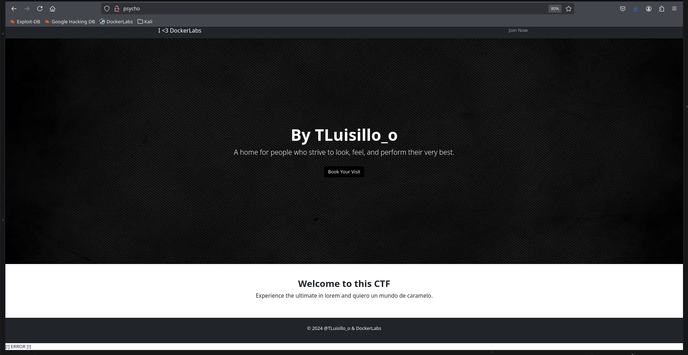

# Write Up Psycho

**Dificultad:** Super fácil<br>
**Enlace a dockerlabs:** https://dockerlabs.es/

## Configuración del entorno
Primero de todo desplegamos la máquina mediante el script que viene al descargar la máquina

```
❯ chmod +x auto_deploy.sh
❯ sudo ./auto_deploy.sh psycho.tar

	                   ##        .         
	             ## ## ##       ==         
	          ## ## ## ##      ===         
	      /""""""""""""""""\___/ ===       
	 ~~~ {~~ ~~~~ ~~~ ~~~~ ~~ ~ /  ===- ~~~
	      \______ o          __/           
	        \    \        __/            
	         \____\______/               
                                          
  ___  ____ ____ _  _ ____ ____ _    ____ ___  ____ 
  |  \ |  | |    |_/  |___ |__/ |    |__| |__] [__  
  |__/ |__| |___ | \_ |___ |  \ |___ |  | |__] ___] 
                                         
				    

Estamos desplegando la máquina vulnerable, espere un momento.

Máquina desplegada, su dirección IP es --> 172.17.0.2

Presiona Ctrl+C cuando termines con la máquina para eliminarla
```

Una vez desplegada, creamos la carpeta obsession, nos metemos dentro y usamos la utilidad *mkt* que nos crea las carpetas *nmap*, *content*, *exploits* y *scripts*.

```
❯ mkdir obsession
❯ cd obsession
❯ mkt
❯ ls -l
drwxrwxr-x godack godack 4.0 KB Thu Aug 28 16:28:18 2025  content
drwxrwxr-x godack godack 4.0 KB Thu Aug 28 16:28:18 2025  exploits
drwxrwxr-x godack godack 4.0 KB Thu Aug 28 16:28:18 2025  nmap
drwxrwxr-x godack godack 4.0 KB Thu Aug 28 16:28:18 2025  scripts
.rwxr-xr-x godack godack 5.1 KB Tue Jun 25 07:31:52 2024  auto_deploy.sh
.rw-r--r-- godack godack 427 MB Sat Aug 10 11:13:22 2024  psycho.tar
.rw-rw-r-- godack godack 149 MB Thu Aug 28 16:25:54 2025  psycho.zip
```

## Reconocimiento
Como siempre, comenzaremos con nmap, y con un escaneo rápido y silencioso para descubrir los puertos abiertos

```
❯ nmap -p- --open -sS --min-rate 5000 -vvv -n -Pn 172.17.0.2 -oG allPorts
Host discovery disabled (-Pn). All addresses will be marked 'up' and scan times may be slower.
Starting Nmap 7.95 ( https://nmap.org ) at 2025-08-28 16:36 CEST
Initiating ARP Ping Scan at 16:36
Scanning 172.17.0.2 [1 port]
Completed ARP Ping Scan at 16:36, 0.08s elapsed (1 total hosts)
Initiating SYN Stealth Scan at 16:36
Scanning 172.17.0.2 [65535 ports]
Discovered open port 22/tcp on 172.17.0.2
Discovered open port 80/tcp on 172.17.0.2
Completed SYN Stealth Scan at 16:36, 1.00s elapsed (65535 total ports)
Nmap scan report for 172.17.0.2
Host is up, received arp-response (0.0000080s latency).
Scanned at 2025-08-28 16:36:41 CEST for 1s
Not shown: 65533 closed tcp ports (reset)
PORT   STATE SERVICE REASON
22/tcp open  ssh     syn-ack ttl 64
80/tcp open  http    syn-ack ttl 64
```

Ahora, mediante la utilidad extractPorts, copiamos los puertos en el portapapeles y realizamos el segundo escaneo

```
❯ extractPorts allPorts
───────┬──────────────────────────────────────────────────────────────────────────────────────────────────────────────────────────────────────────────────────────────────────────────────
       │ File: extractPorts.tmp
───────┼──────────────────────────────────────────────────────────────────────────────────────────────────────────────────────────────────────────────────────────────────────────────────
   1   │ 
   2   │ [*] Extracting information...
   3   │ 
   4   │     [*] IP Address: 172.17.0.2
   5   │     [*] Open ports: 22,80
   6   │ 
   7   │ [*] Ports copied to clipboard
   8   │ 
───────┴──────────────────
❯ nmap -sCV -p22,80 172.18.0.2 -oN targeted
Starting Nmap 7.95 ( https://nmap.org ) at 2025-08-28 16:37 CEST
Nmap scan report for 172.18.0.2
Host is up (0.00080s latency).

PORT   STATE    SERVICE VERSION
22/tcp filtered ssh
80/tcp filtered http

Service detection performed. Please report any incorrect results at https://nmap.org/submit/ .
Nmap done: 1 IP address (1 host up) scanned in 7.07 seconds
```

Los puertos que estan abiertos son el puerto SSH (puerto 22) y el puerto HTTP (puerto 80).
## Explotación
Lo primero que hacemos es ver la página web, y lo que nos llama la atención es el mensaje de error de la esquina inferior izquierda, a la cual no le hago mucho caso y al ver que no hay nada mas en la web y que los botones no hacen nada, pruebo sin éxito un ataque de fuerza bruta al servicio ssh con el usuario ``TLuisillo_o``.

1.png

Lo siguiente que pruebo es a hacer fuzzing de directorios, y lo único que encuentro es la carpeta *assets* con el fondo que usa la web.

```
❯ gobuster dir -u http://psycho/ -w /usr/share/wordlists/SecLists/Discovery/Web-Content/DirBuster-2007_directory-list-2.3-big.txt -t 20 -x html,php,txt,php.bak
===============================================================
Gobuster v3.6
by OJ Reeves (@TheColonial) & Christian Mehlmauer (@firefart)
===============================================================
[+] Url:                     http://psycho/
[+] Method:                  GET
[+] Threads:                 20
[+] Wordlist:                /usr/share/wordlists/SecLists/Discovery/Web-Content/DirBuster-2007_directory-list-2.3-big.txt
[+] Negative Status codes:   404
[+] User Agent:              gobuster/3.6
[+] Extensions:              html,php,txt,php.bak
[+] Timeout:                 10s
===============================================================
Starting gobuster in directory enumeration mode
===============================================================
/index.php            (Status: 200) [Size: 2596]
/.html                (Status: 403) [Size: 271]
/.php                 (Status: 403) [Size: 271]
/assets               (Status: 301) [Size: 301] [--> http://psycho/assets/]
```

Así que volviendo al error anterior, y viendo que la web es un php, podemos pensar que se está llamando a alguna función que devuelve un error. Para ello hacemos fuzzing de parámetros con wfuzz, para averiguar si es ese el problema.

```
❯ wfuzz -c -w /usr/share/wordlists/SecLists/Discovery/Web-Content/burp-parameter-names.txt -u "http://psycho?FUZZ=1"
 /usr/lib/python3/dist-packages/wfuzz/__init__.py:34: UserWarning:Pycurl is not compiled against Openssl. Wfuzz might not work correctly when fuzzing SSL sites. Check Wfuzz's documentation for more information.
********************************************************
* Wfuzz 3.1.0 - The Web Fuzzer                         *
********************************************************

Target: http://psycho?FUZZ=1/
Total requests: 6453

=====================================================================
ID           Response   Lines    Word       Chars       Payload                                                                                                                  
=====================================================================

000000001:   200        62 L     169 W      2596 Ch     "1"                                                                                                                      
000000003:   200        62 L     169 W      2596 Ch     "12"                                                                                                                     
000000007:   200        62 L     169 W      2596 Ch     "16"                                                                                                                     
000000015:   200        62 L     169 W      2596 Ch     "4"                                                                                                                      
000000050:   200        62 L     169 W      2596 Ch     "Block"                                                                                                                  
000000031:   200        62 L     169 W      2596 Ch     "AddressResult"                                                                                                          
000000049:   200        62 L     169 W      2596 Ch     "Beverages"                                                                                                              
000000048:   200        62 L     169 W      2596 Ch     "BackURL"                                                                                                                
000000047:   200        62 L     169 W      2596 Ch     "BIGGER"                                                                                                                 
000000046:   200        62 L     169 W      2596 Ch     "B"                                                                                                                      
000000042:   200        62 L     169 W      2596 Ch     "AuthChildForm"                                                                                                          
000000038:   200        62 L     169 W      2596 Ch     "Attachment"                                                                                                             
000000037:   200        62 L     169 W      2596 Ch     "AssignmentForm"                                                                                                         
000000041:   200        62 L     169 W      2596 Ch     "AudioPlayerSubmit"                                                                                                      
000000045:   200        62 L     169 W      2596 Ch     "AuthItemForm"                                                                                                           
000000039:   200        62 L     169 W      2596 Ch     "AttachmentName"                                                                                                         
000000040:   200        62 L     169 W      2596 Ch     "AudioPlayerReset"                                                                                                       
000000036:   200        62 L     169 W      2596 Ch     "Artist"                                                                                                                 
000000044:   200        62 L     169 W      2596 Ch     "AuthItemChild"                                                                                                          
000000043:   200        62 L     169 W      2596 Ch     "AuthItem"                                                                                                               
000000028:   200        62 L     169 W      2596 Ch     "Action"                                                                                                                 
000000035:   200        62 L     169 W      2596 Ch     "Article"                                                                                                                
000000029:   200        62 L     169 W      2596 Ch     "AddAuthItemForm"                                                                                                        
000000030:   200        62 L     169 W      2596 Ch     "Address"                                                                                                                
000000034:   200        62 L     169 W      2596 Ch     "Albania"                                                                                                                
000000033:   200        62 L     169 W      2596 Ch     "Admin"                                                                                                                  
000000032:   200        62 L     169 W      2596 Ch     "AddressStatus"                                                                                                          
000000027:   200        62 L     169 W      2596 Ch     "Accounts"                                                                                                               
000000026:   200        62 L     169 W      2596 Ch     "AccountNumber"                                                                                                          
000000025:   200        62 L     169 W      2596 Ch     "AVSCV2"                           
```

De esta manera vemos que los parámetros incorrectos devuelven una página web con 2596 caracteres, por lo que filtraremos para que no nos salgan estos casos (y solo nos salgan los que den mas o menos)

```
❯ wfuzz -c --hh 2596 -w /usr/share/wordlists/SecLists/Discovery/Web-Content/burp-parameter-names.txt -u "http://psycho?FUZZ=1"
 /usr/lib/python3/dist-packages/wfuzz/__init__.py:34: UserWarning:Pycurl is not compiled against Openssl. Wfuzz might not work correctly when fuzzing SSL sites. Check Wfuzz's documentation for more information.
********************************************************
* Wfuzz 3.1.0 - The Web Fuzzer                         *
********************************************************

Target: http://psycho?FUZZ=1/
Total requests: 6453

=====================================================================
ID           Response   Lines    Word       Chars       Payload                                                                                                                  
=====================================================================

000005057:   200        62 L     166 W      2582 Ch     "secret"                                                                                                                 

Total time: 8.446084
Processed Requests: 6453
Filtered Requests: 6452
Requests/sec.: 764.0227
```

Así descubrimos que el posible parámetro es ``secret``. De esta manera, lo probamos en la web con un numero aleatorio y vemos que ya no devuelve el error de antes.


Ahora procedemos a probar cosas y vemos que lo que hace es enumerar archivos de la máquina víctima, de manera que enumeramos el archivo ``/etc/password`` para obtener usuarios y volver a intentar ataques de fuerza bruta.
